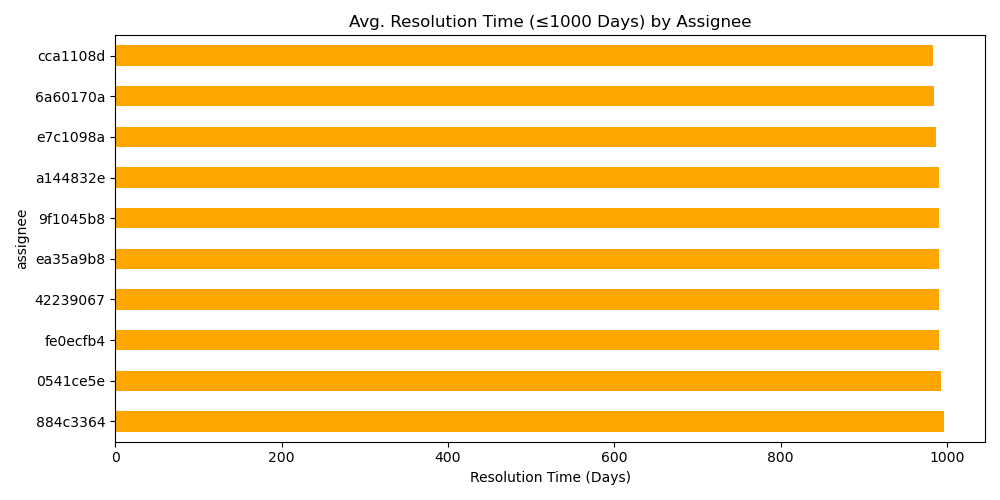
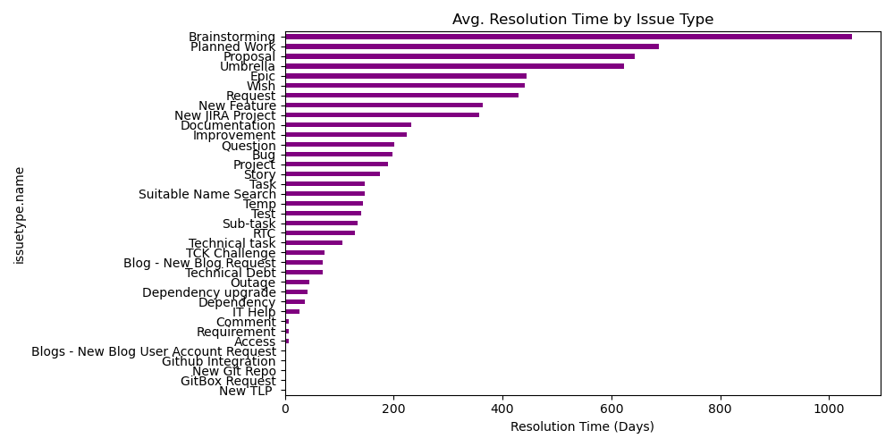
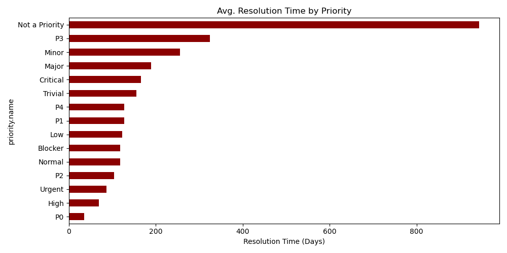

# Jira Issue Tracking & Team Productivity Analysis

Analyzed Jira issue data from open-source Apache projects to evaluate:
- 🧑‍💻 Team workload and issue assignment
- ⏱️ Average resolution time
- 📈 Sprint velocity (issues resolved/month)
- 🐞 Bottlenecks by issue status, type, and priority

## Key Insights
- Some team members handled 10x more issues than others.
- High-priority issues sometimes took longer than medium ones.
- Sprint velocity dropped sharply during holiday months.

## 📊 Key Visuals

### 🔹 Top 10 Assignees by Issue Count

### 🔹 Avg. Resolution Time by Assignee (≤ 1000 days)

### 🔹 Sprint Velocity – Issues Resolved per Month

### 🔹 Avg. Resolution Time by Issue Type

### 🔹 Avg. Resolution Time by Priority

## Tech Stack
- Python (Pandas, Matplotlib, Seaborn)
- Jupyter Notebook
- Dataset: [Apache Jira Issues on Kaggle](https://www.kaggle.com/datasets)

### 🔹 Avg. Resolution Time by Issue Type

### 🔹 Avg. Resolution Time by Priority

